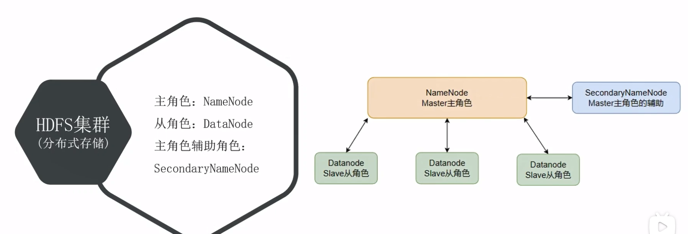
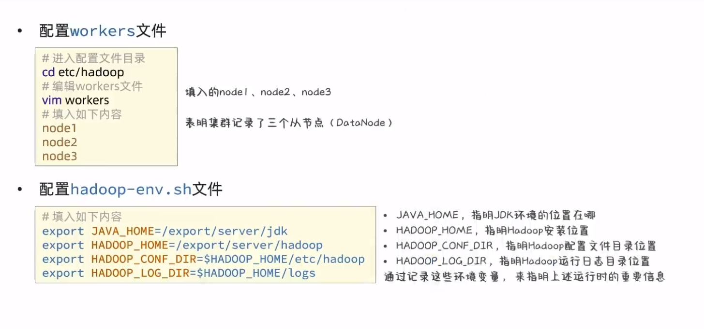
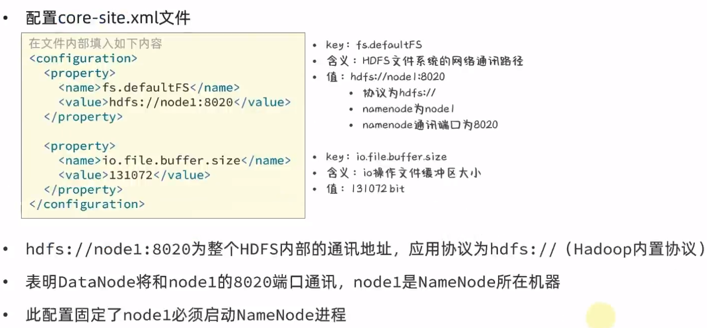
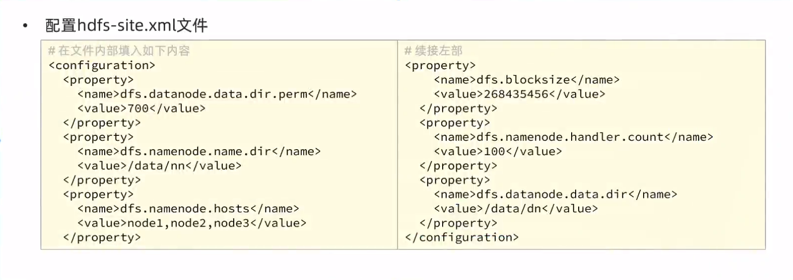
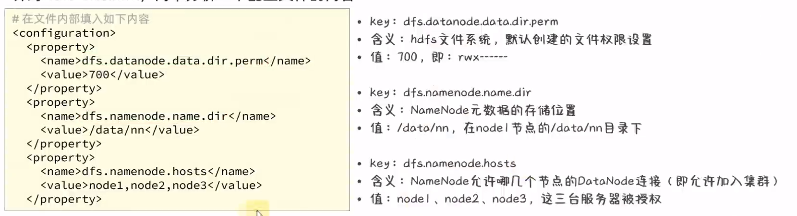
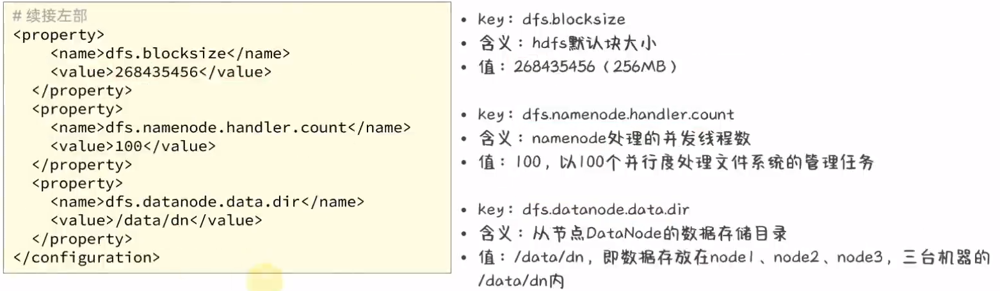

# 为什么需要分布式存储

- 数据量太大,单机存储能力有上限,需要靠数量来解决问题

- 数量的提升带来的是网络传输、磁盘读写、CPU、内存等各方面的综合提升。分布式组合在一起可以达到1+1>2的效果

# 分布式的基础架构分析

## 1、分布式系统常见的组织形式

- 去中心化模式：没有明确中心，大家协调工作
- 中心化模式：有明确的中心，基于中心节点分工作

## 2、什么是主从模式

- 主从模式(Master-Slaves)就是中心化模式，表示有一个主节点来作为管理者，管理协调下属一批从节点工作

## 3、Hadoop是哪种模式？

主从模式(中心化模式)

# HDFS 的基础架构

## 1、什么是HDFS?

- HDFS全称：Hadoop Distributed File System
- 是Hadoop三大组件(HDFS、MapReduce、YARN)之一
- 可在多台服务器上构建集群，提供分布式数据存储能力

## 2、HDFS中架构角色有哪些？

- NameNode：主角色，管理HDFS集群和DataNode角色
- DataNode：从角色，负责数据的存储
- SecondaryNameNode：辅助角色，协助NameNode整理元数据

## 3、HDFS的基础架构



# HDFS集 群环境部署

## 1、修改配置文件，应用自定义配置

- 配置workers文件

```python
# 进入配置文件
cd etc/hadoop
# 编辑workers文件
vim workers
# 填入如下内容   填入的node1、node2、node3表明集群记录了三个从节点
node1
node2
node3      
```


- 配置`hadoop-env.sh`文件

```python
# 填入如下内容
export JAVA_HOME=/export/server/jdk  # JAVA_HOME,指明jdk环境的位置在哪
export HADOOP_HOME=/export/server/hadoop  # HADOOP_HOME,指定hadoop安装位置
export HADOOP_CONF_DIR=$HADOOP_HOME/etc/hadoop  # HADOOP_CONF_DIR,指明Hadoop配置文件目录位置
export HADOOP_LOG_DIR=$HADOOP_HOME/logs  # HADOOP_LOG_DIR,指明Hadoop运行目录位置

# 通过记录这些环境变量，来指明上述运行时的重要信息
```




- 配置`core-site.xml`文件



```python
<configuration>
	<property>
		<name>fs.defaultFS</name>
		<value>hdfs://nodel:8020</value>
	</property>
            
	<property>
		<name>io.file.buffer.size</name>
		<value>131072</value>
	</property>
</configuration>

```

- 配置`hdfs-site.xml`文件







```python
<configuration>
	<property>
		<name>dfs.datanode.data.dir.perm</name>
		<value>700</value>
	</property>
	<property>
		<name>dfs.namenode.name.dir</name>
		<value>/data/nn</value>
	</property>
	<property>
		<name>dfs.namenode.hosts</name>
		<value>node1node2,node3</value>
	</property>
    <property>
		<name>dfs.blocksize</name>
		<value>268435456</value>
	</property>
	<property>
		<name>dfs.namenode.handler.count</name>
		<value>100</value>
	</property>
	<property>
		<name>dfs .datanode.data.dir</name>
		<value>/data/dn</value>
	</property>
</configuration>


```


# HDFS的存储 原理


# HDFS的Shell操作