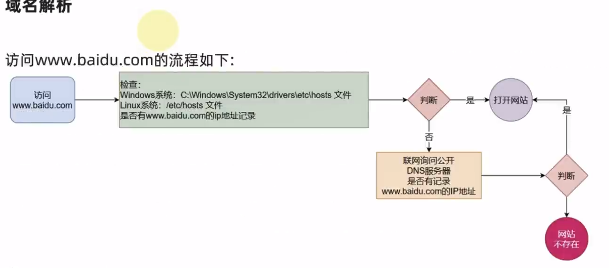
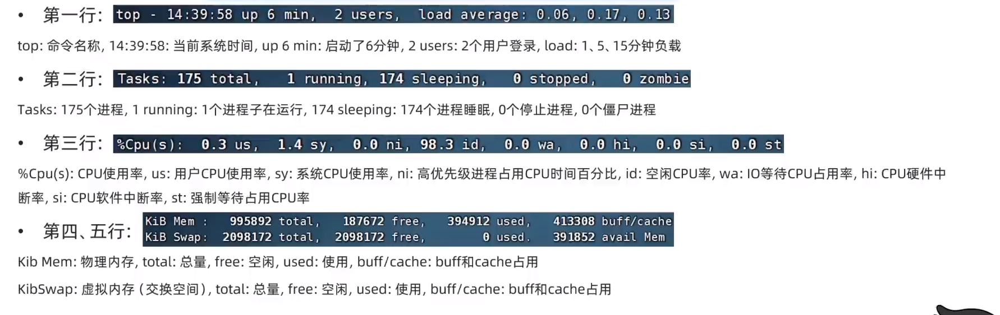

# Linux常用操作

## 常用快捷命令

- `ctrl c`强制退出
- `ctrl d`退出登录
- `!`命令前缀，自动匹配上一个命令
- `ctrl r`搜索历史命令
- `ctrl +a|e`光标移动到命令开始或结束
- `ctrl + <- | ->`,左右跳单词
- `ctrl +l 或 clear`命令 清屏

## 软件安装

- `CentOS`系统使用：
  - `yum [-y] [install | remove | search]  软件名称`
    - install 安装
    - remove 卸载
    - search 搜索
    - -y，自动确认
- `Ubuntu`系统使用
  - `apt [-y]  [install | remove | search] 软件名称`
    - install 安装
    - remove 卸载
    - search 搜索
    - -y，自动确认

> yum 和 apt 均需要root权限


## systemctl

功能：控制系统服务的启动关闭等

语法：`systemctl start | stop | restart | disable | enable | status 服务名`

- start，启动
- stop，停止
- status，查看状态
- disable，关闭开机自启
- enable，开启开机自启
- restart，重启


## 软链接

功能：创建文件、文件夹软链接（快捷方式）

语法：`ln -s 参数1 参数2`

- 参数1：被链接的文件、文件夹
- 参数2：要链接去的地方（快捷方式的名称和存放位置）


## 日期

语法：`date [-d] [+格式化字符串]`

- -d 按照给定的字符串显示日期，一般用于日期计算

- 格式化字符串：通过特定的字符串标记，来控制显示的日期格式
  - %Y   年%y   年份后两位数字 (00..99)
  - %m   月份 (01..12)
  - %d   日 (01..31)
  - %H   小时 (00..23)
  - %M   分钟 (00..59)
  - %S   秒 (00..60)
  - %s   自 `1970-01-01 00:00:00 UTC` 到现在的秒数


示例：

- 按照`2022-01-01`的格式显示日期

  

- 按照`2022-01-01 10:00:00`的格式显示日期

  

- -d选项日期计算

  

  - 支持的时间标记为：

    


## 时区

修改时区为中国时区


## ntp

功能：同步时间

安装：`yum install -y ntp`

启动管理：`systemctl start | stop | restart | status | disable | enable ntpd`

**`ntp`的服务名是后面加了一个`d`，变成了`ntpd`**


手动校准时间：`ntpdate -u ntp.aliyun.com`


## ip地址

格式：`a.b.c.d`

- abcd为0~255的数字


特殊IP：

- 127.0.0.1，表示本机
- 0.0.0.0
  - 可以表示本机
  - 也可以表示任意IP（看使用场景）


查看ip：`ifconfig`


## 主机名

功能：Linux系统的名称

查看：`hostname`

设置：`hostnamectl set-hostname 主机名`


## 域名解析(主机名映射)

可以通过主机名找到对用的计算机的`ip`地址，这就是主机名映射(域名解析)

先从我们系统本地的记录中去查找，如果找不到就联网去公开`DNS`服务器去查找

- 先查看本机的记录(私人地址本)
- Windows看:  `C:\Windows\System32\drivers\etc\hosts`
- Linux看 ： `/etc/hosts`
- 再联网去`DNS`服务器(如114.114.114.114,8.8.8.8)询问




## 配置VMware固定IP

1. 修改VMware网络，参阅PPT，图太多

2. 设置Linux内部固定IP

   修改文件：`/etc/sysconfig/network-scripts/ifcfg-ens33`

   示例文件内容：

   ```shell
   TYPE="Ethernet"
   PROXY_METHOD="none"
   BROWSER_ONLY="no"
   BOOTPROTO="static"			# 改为static，固定IP
   DEFROUTE="yes"
   IPV4_FAILURE_FATAL="no"
   IPV6INIT="yes"
   IPV6_AUTOCONF="yes"
   IPV6_DEFROUTE="yes"
   IPV6_FAILURE_FATAL="no"
   IPV6_ADDR_GEN_MODE="stable-privacy"
   NAME="ens33"
   UUID="1b0011cb-0d2e-4eaa-8a11-af7d50ebc876"
   DEVICE="ens33"
   ONBOOT="yes"
   IPADDR="192.168.88.131"		# IP地址，自己设置，要匹配网络范围
   NETMASK="255.255.255.0"		# 子网掩码，固定写法255.255.255.0
   GATEWAY="192.168.88.2"		# 网关，要和VMware中配置的一致
   DNS1="192.168.88.2"			# DNS1服务器，和网关一致即可
   ```


## ps命令

功能：查看进程信息

语法：`ps -ef`，查看全部进程信息，可以搭配grep做过滤：`ps -ef | grep xxx`


## kill命令


## nmap命令


## netstat命令

功能：查看本机指定端口号的占用情况

用法：`netstat -anp | grep 端口号`

- 什么是端口?
  端口是指计算机和外部交互的出入口,可以分为物理端口和虚拟端口
  物理端口: `USB、HDMI、DP、VGA、RJ45`等
  虚拟端口:操作系统和外部交互的出入口
  IP只能确定计算机,通过端口才能锁定要交互的程序
- 端口的划分
  公认端口:1~1023,用于系统内置或常用知名软件绑定使用.
  注册端口: 1024~49151,用于松散绑定使用(用户自定义)
  动态端口: 49152~65535,用于临时使用(多用于出口)

## ping命令

测试网络是否联通

语法：`ping [-c num] 参数`


## wget命令


## curl命令


## top命令

功能：查看主机运行状态

语法：`top`，查看基础信息



可用选项：


交互式模式中，可用快捷键：


## df命令

查看磁盘占用


## iostat命令

查看CPU、磁盘的相关信息


## sar命令

查看网络统计


## 环境变量

- 临时设置：export 变量名=变量值
- 永久设置：
  - 针对用户，设置用户HOME目录内：`.bashrc`文件
  - 针对全局，设置`/etc/profile`


### PATH变量

记录了执行程序的搜索路径

可以将自定义路径加入PATH内，实现自定义命令在任意地方均可执行的效果


## $符号

可以取出指定的环境变量的值

语法：`$变量名`

示例：

`echo $PATH`，输出PATH环境变量的值

`echo ${PATH}ABC`，输出PATH环境变量的值以及ABC

如果变量名和其它内容混淆在一起，可以使用${}


## 压缩解压

### 压缩

`tar -zcvf 压缩包 被压缩1...被压缩2...被压缩N`

- -z表示使用gzip，可以不写


`zip [-r] 参数1 参数2 参数N`


### 解压

`tar -zxvf 被解压的文件 -C 要解压去的地方`

- -z表示使用gzip，可以省略
- -C，可以省略，指定要解压去的地方，不写解压到当前目录


`unzip [-d] 参数`


## su命令

切换用户

语法：`su [-] [用户]`


## sudo命令


比如：

```shell
itheima ALL=(ALL)       NOPASSWD: ALL
```

在visudo内配置如上内容，可以让itheima用户，无需密码直接使用`sudo`


## chmod命令

修改文件、文件夹权限


语法：`chmod [-R] 权限 参数`

- 权限，要设置的权限，比如755，表示：`rwxr-xr-x`

  

- 参数，被修改的文件、文件夹

- 选项-R，设置文件夹和其内部全部内容一样生效


## chown命令

修改文件、文件夹所属用户、组


语法：`chown [-R] [用户][:][用户组] 文件或文件夹`


## 用户组管理


## 用户管理


## genenv命令

- `getenv group`，查看系统全部的用户组

  

- `getenv passwd`，查看系统全部的用户

  


## env命令

查看系统全部的环境变量

语法：`env`


