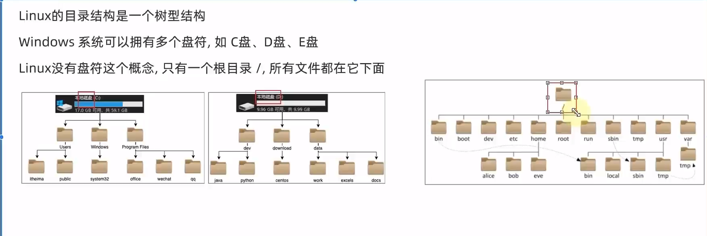
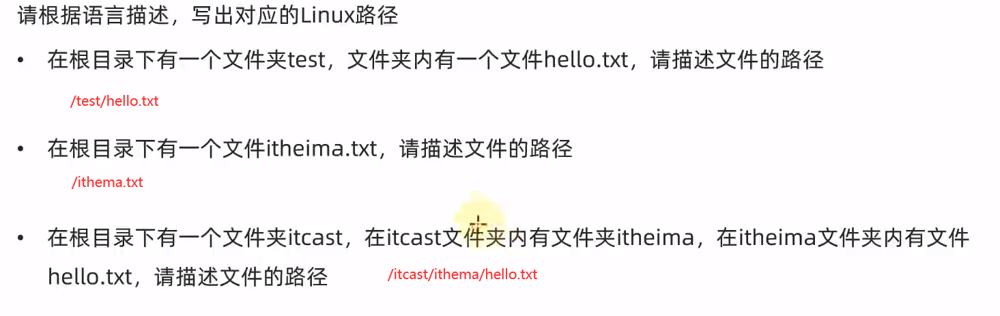

# linux从入门到进阶

## 一、初识Linux

### 1、操作系统概述

- 计算机由哪两个主要部分组成?
  硬件和软件
- 操作系统是什么?有什么作用?
  操作系统是软件的一类。
  主要作用是协助用户调度硬件工作，充当用户和计算机硬件之间的桥梁
- 常见的操作系统有哪些?
  PC端: Windows、Linux、MacOS
  移动端: Android、 I0S、鸿蒙系统

## 2、初识Linux

- Linux的诞生
  Linux由林纳斯托瓦兹在1991年创立并发展至今成为服务器操作系统领域的
  核心系统。
- 什么是Linux系统的内核
  内核提供了Linux系统的主要功能，如硬件调度管理的能力。
  Linux内核是免费开源的，任何人都可以查看内核的源代码，甚至是贡献源代
  码。
- 什么是Linux系统发行版
  内核无法被用户直接使用，需要配合应用程序才能被用户使用。
  在内核之上，封装系统级应用程序,组合在一起就称之为Linux发行版。
  发行版众多,课程主要基于CentOS辅以Ubuntu进行讲解

## 3、虚拟机介绍

- 什么是虚拟机?
  通过虚拟化技术，在电脑内，虚拟出计算机硬件，并给虚拟的硬件安装操作
  系统，即可得到一台虚拟的电脑,称之为虚拟机。
- 为什么要使用虚拟机?
  学习Linux系统，需要有Linux系统环境。
  我们不能给自己电脑重装系统为Linux,所以通过虚拟机的形式，得到可以用
  的Linux系统环境，供后续学习使用。

# 二、Linux基础命令

## 1、Linux的目录结构

### 1.1 Linux目录

### 1.2 /在Linux系统中的表示

- /出现在开头：表示根目录
- /出现在后面部分：表示层次关系

/usr/local/hello.txt

## 2、Linux基础命令

[Linux基础命令附件](Linux基础命令.md)

详细命令点击链接查看

# 三、Linux权限管控

# 四、Linux实用操作

# 五、实战软件部署

# 六、脚本&自动化

# 七、项目实战

# 八、云平台技术

